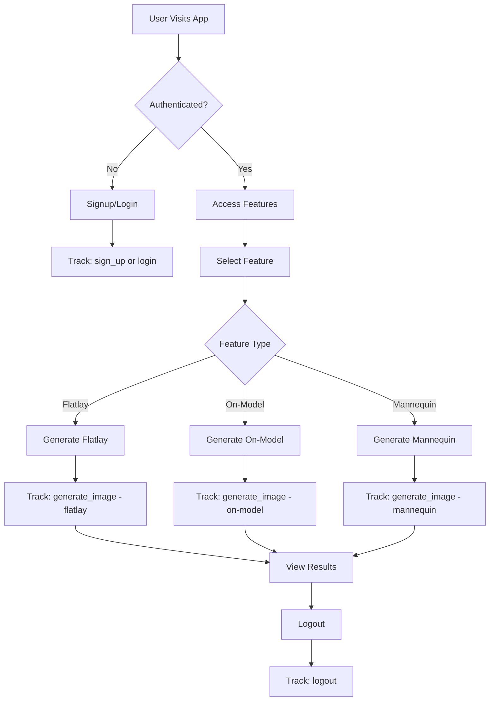

# Event Tracking Implementation Summary

## ✅ Tracking Added

Event tracking has been successfully integrated into your Vestis application! Here's what's now being tracked:

### 🔐 Authentication Events

**Files Modified:**
- `src/hooks/useAuth.ts`
- `src/features/auth/components/OAuthCallback.tsx`

**Events Tracked:**
| Event | Trigger | Method Parameter |
|-------|---------|------------------|
| `login` | User logs in with email/password | `'email'` |
| `login` | User logs in with Google OAuth | `'google'` |
| `sign_up` | User creates account with email | `'email'` |
| `logout` | User logs out | N/A |

**Usage Example:**
```typescript
// These are automatically tracked, no manual implementation needed
await login({ email, password }); // Tracks: login('email')
await signup({ email, password, name }); // Tracks: sign_up('email')
logout(); // Tracks: logout()
```

### 🎨 Image Generation Events

**Files Modified:**
- `src/services/flatLayService.ts`
- `src/services/onModelPhotosService.ts`
- `src/services/mannequinService.ts`

**Events Tracked:**
| Feature | Event | Credit Cost |
|---------|-------|-------------|
| Flatlay | `generate_image` | 10 credits |
| On-Model | `generate_image` | 10 credits |
| Mannequin | `generate_image` | 10 credits |

**Event Parameters:**
```typescript
{
  feature_type: 'flatlay' | 'on-model' | 'mannequin',
  credit_cost: 10
}
```

**Usage Example:**
```typescript
// These are automatically tracked when generation succeeds
await flatLayService.generateFlatlay(request);
// Tracks: generateImage('flatlay', 10)

await onModelPhotosService.generateOnModel(request);
// Tracks: generateImage('on-model', 10)

await mannequinService.generateMannequin(request);
// Tracks: generateImage('mannequin', 10)
```

### 📥 Image Download Events

**Files Modified:**
- `src/features/generation/components/FlatLayPhotos.tsx`
- `src/features/generation/components/OnModelPhotos.tsx`

**Events Tracked:**
| Feature | Event | Trigger |
|---------|-------|---------|
| Flatlay | `image_download` | User downloads flatlay image |
| On-Model | `image_download` | User downloads on-model image |

**Event Parameters:**
```typescript
{
  feature_type: 'flatlay' | 'on-model'
}
```

**Usage Example:**
```typescript
// These are automatically tracked when user clicks download
FeatureEvents.downloadImage('flatlay');
FeatureEvents.downloadImage('on-model');
```

## 📊 What You Can Track in Google Analytics

### Standard Reports

1. **User Acquisition**
   - See login methods (email vs Google)
   - Track signup conversions

2. **Feature Usage**
   - Which generation features are most popular
   - Usage frequency by feature type

3. **User Behavior**
   - Login → Feature Usage funnel
   - Retention after signup

### Custom Reports & Explorations

Create custom reports to analyze:

**Login Method Analysis:**
```
Event: login
Parameter: method
Breakdown: email vs google
```

**Feature Popularity:**
```
Event: generate_image
Parameter: feature_type
Metrics: event count, unique users
```

**Credit Usage:**
```
Event: generate_image
Parameter: credit_cost
Metrics: total credits consumed
```

## 🎯 Recommended GA4 Conversions

Mark these events as conversions in GA4:

1. **sign_up** - Track user registrations
2. **generate_image** - Track feature engagement
3. **purchase** - When you add credit purchases (already in analytics.ts)

**How to set up conversions:**
1. Go to GA4 Admin > Events
2. Find the event name
3. Toggle "Mark as conversion"

## 🚀 Ready-to-Use Events (Not Yet Implemented)

Your analytics utility includes pre-built functions ready to use:

### Commerce Events
```typescript
import { CommerceEvents } from '@/utils/analytics';

// When user views pricing page
CommerceEvents.viewPricing();

// When user purchases credits
CommerceEvents.purchaseCredits(100, 9.99);

// When user adds to cart
CommerceEvents.addToCart('100 Credits', 100, 9.99);
```

### Feature Events
```typescript
import { FeatureEvents } from '@/utils/analytics';

// Track image uploads
FeatureEvents.uploadImage('flatlay');

// Track image downloads
FeatureEvents.downloadImage('on-model');
```

### Engagement Events
```typescript
import { EngagementEvents } from '@/utils/analytics';

// Track image sharing
EngagementEvents.shareImage('flatlay');

// Track support contact
EngagementEvents.contactSupport();

// Track tutorial views
EngagementEvents.viewTutorial('getting-started');
```

## 📝 Next Steps

### Immediate Actions

1. **Set Up Conversions**
   - Mark `sign_up` as conversion in GA4
   - Mark `generate_image` as conversion for engagement tracking

2. **Create Custom Reports**
   - Feature usage breakdown
   - Login method comparison
   - User journey funnel (signup → login → generate)

3. **Monitor Data**
   - Check Realtime reports to verify events are firing
   - Wait 24-48 hours for data in standard reports

### Future Enhancements

Consider adding tracking for:

- **Image Downloads** - Track when users download generated images
- **Feature Adoption** - Track first-time feature usage
- **Credit Purchases** - Track payment completion
- **Sharing** - Track social media shares
- **Tutorial Views** - Track help/tutorial engagement
- **Error Events** - Track generation failures or errors

## 🔍 Testing Your Tracking

1. **Browser Console**
   - Look for console logs: `📊 GA Event tracked: {eventName}`

2. **GA4 Realtime**
   - Open GA4 Dashboard
   - Go to Reports > Realtime
   - Perform actions (login, generate image)
   - See events appear within seconds

3. **DebugView** (Optional)
   - Enable debug mode in `GoogleAnalytics.tsx`
   - View detailed event data in GA4 DebugView

## 🎨 Event Visualization



## 💡 Pro Tips

1. **Segment Users**
   - Create audiences in GA4 based on feature usage
   - Target users who signed up but haven't generated images

2. **Track Conversion Funnels**
   - Signup → First Generation
   - View Pricing → Purchase Credits

3. **Monitor Feature Health**
   - Track generation success vs failure rates
   - Monitor credit consumption patterns

4. **A/B Testing**
   - Use GA4 data to inform feature improvements
   - Test different onboarding flows

---

**Your analytics are live and tracking! 📊✨**

Check your [Google Analytics Dashboard](https://analytics.google.com) to see the data flowing in!
